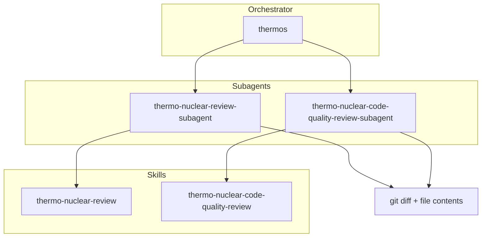

# Thermos plugin

Thermo-nuclear branch review: deep correctness and security audits, harsh maintainability rubrics, and parallel subagent orchestration.

## Installation

```bash
/plugin install thermos
```

## Architecture



## Skills

| Skill | Description |
|:------|:------------|
| `thermo-nuclear-review` | Deep branch audit (bugs, breakages, security, devex, feature-gate leaks). |
| `thermo-nuclear-code-quality-review` | Strict maintainability audit (code-judo, 1k-line rule, spaghetti, boundaries). |
| `thermos` | Run both review subagents in parallel and synthesize findings. |

## Agents

| Agent | Description |
|:------|:------------|
| `thermo-nuclear-review-subagent` | Task subagent for deep review rubric (diff-scoped). |
| `thermo-nuclear-code-quality-review-subagent` | Task subagent for code-quality rubric (diff-scoped). |

## Typical usage

**Double review (thermos):**

1. Gather `git diff main...HEAD` and full contents of changed files.
2. Invoke both subagents in one message with `run_in_background: true`.
3. Synthesize prioritized, deduped findings.

**Single skill:** invoke `thermo-nuclear-review` or `thermo-nuclear-code-quality-review` in the main agent, or the matching subagent after gathering diff context.

## Using this plugin with OpenCode

OpenCode has no plugin-install mechanism for skill/agent bundles — copy the files you want into OpenCode's own directories:

```bash
# skills (project-local)
cp -r skills/* .opencode/skills/

# skills (global, all projects)
cp -r skills/* ~/.config/opencode/skills/

# both review subagents
cp opencode/agent/*.md .opencode/agent/
```

`skills/*/SKILL.md` files use the shared [Agent Skills](https://agentskills.io) open standard and work unmodified. The `opencode/agent/` directory ships OpenCode-native versions of both subagents — mention them directly with `@thermo-nuclear-review-subagent` or `@thermo-nuclear-code-quality-review-subagent` after gathering a diff, since OpenCode has no `Task`-tool equivalent for a parent skill to spawn them automatically in parallel.

## License

MIT
