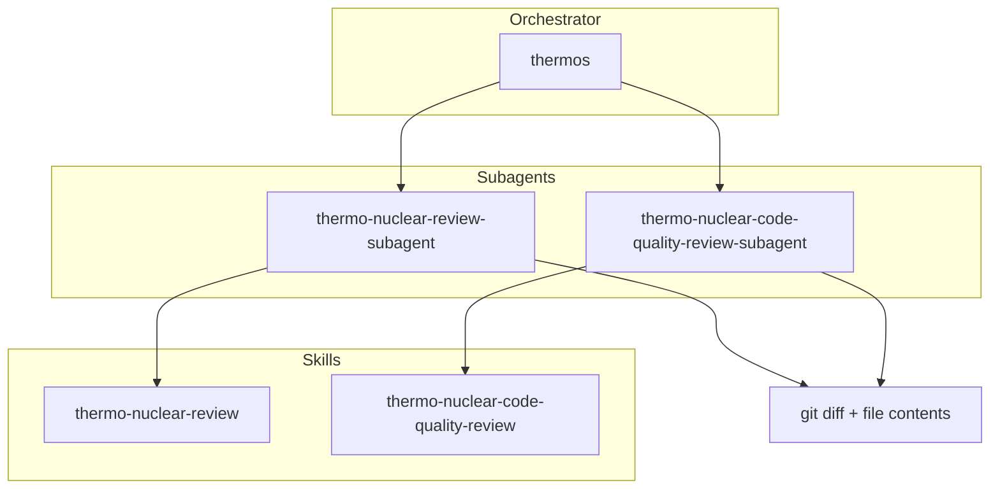

# Thermos plugin

Thermo-nuclear branch review: deep correctness and security audits, harsh maintainability rubrics, and parallel subagent orchestration.

## Install

From the [repository root](../README.md#quick-install-all-plugins):

| OS | Claude Code | OpenCode |
|----|-------------|----------|
| Windows (PowerShell) | `pwsh -File ./scripts/install-claude.ps1 -Plugin thermos` | `pwsh -File ./scripts/install-opencode.ps1 -Plugin thermos` |
| Windows (Git Bash) | `bash ./scripts/install-claude.sh --plugin thermos` | `bash ./scripts/install-opencode.sh --plugin thermos` |
| macOS / Linux | `bash ./scripts/install-claude.sh --plugin thermos` | `bash ./scripts/install-opencode.sh --plugin thermos` |

Restart your agent host after installing.

## Architecture

## Skills

| Skill | Description |
|:------|:------------|
| `thermo-nuclear-review` | Deep branch audit (bugs, breakages, security, devex, feature-gate leaks). |
| `thermo-nuclear-code-quality-review` | Strict maintainability audit (code-judo, 1k-line rule, spaghetti, boundaries). |
| `thermos` | Run both review subagents in parallel and synthesize findings. |

## Agents

| Agent | Description |
|:------|:------------|
| `thermo-nuclear-review-subagent` | Task subagent for deep review rubric (diff-scoped). |
| `thermo-nuclear-code-quality-review-subagent` | Task subagent for code-quality rubric (diff-scoped). |

## Typical usage

**Double review (thermos):**

1. Gather `git diff main...HEAD` and full contents of changed files.
2. Invoke both subagents in one message with `run_in_background: true`.
3. Synthesize prioritized, deduped findings.

**Single skill:** invoke `thermo-nuclear-review` or `thermo-nuclear-code-quality-review` in the main agent, or the matching subagent after gathering diff context.

### Host agents

| Host | Agents |
|------|--------|
| Claude Code (Task subagents) | `thermo-nuclear-review-subagent`, `thermo-nuclear-code-quality-review-subagent` |
| OpenCode (@mention) | same names |

Gather diff context first, then invoke both review subagents in parallel for a full thermos pass.

## License

MIT. Derived from [cursor/plugins](https://github.com/cursor/plugins) — Copyright (c) 2026 Cursor.
